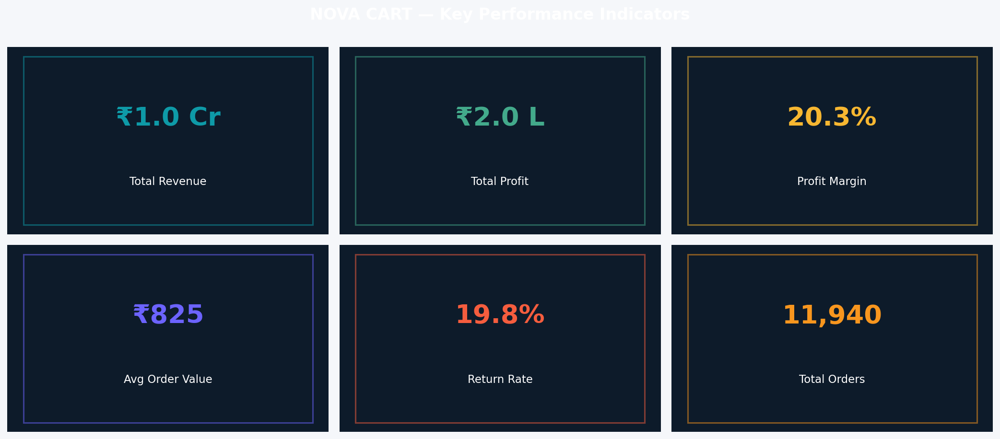
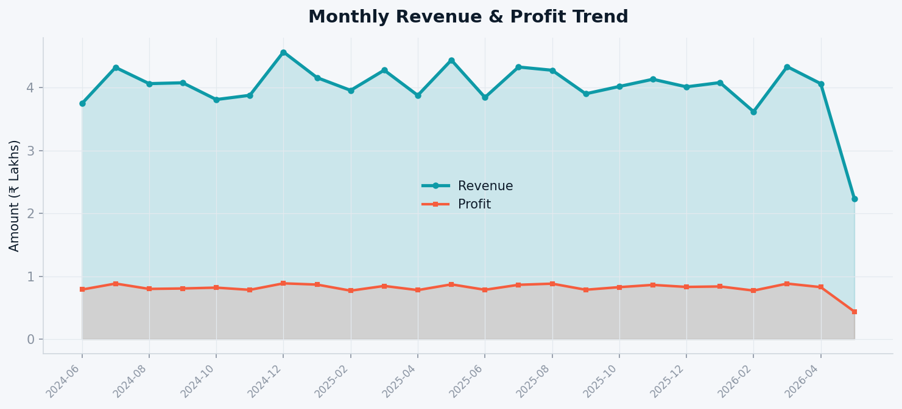
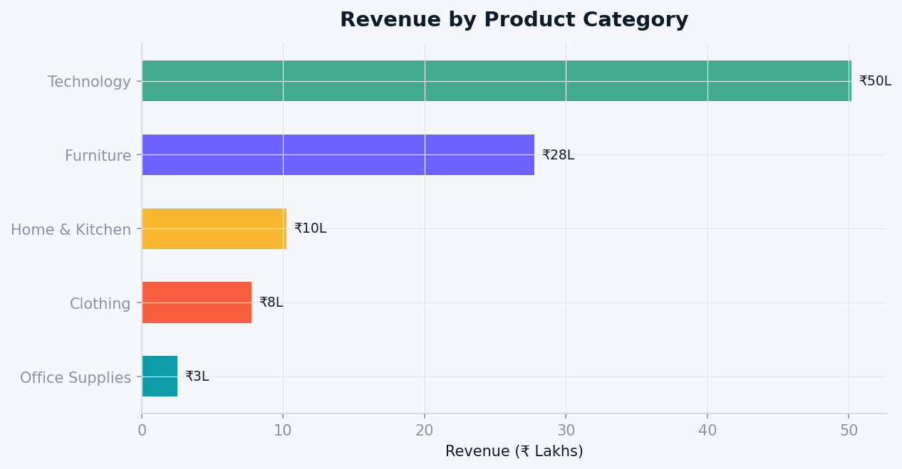
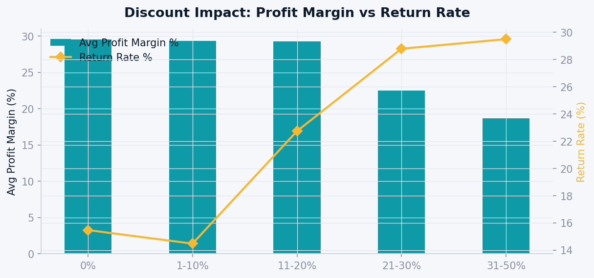
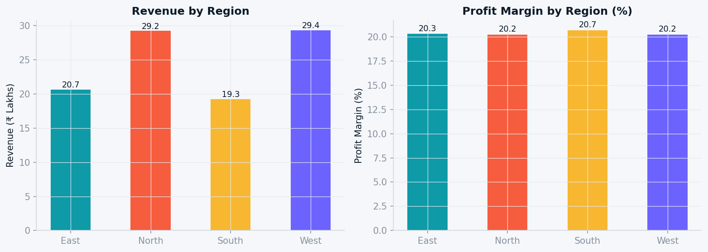
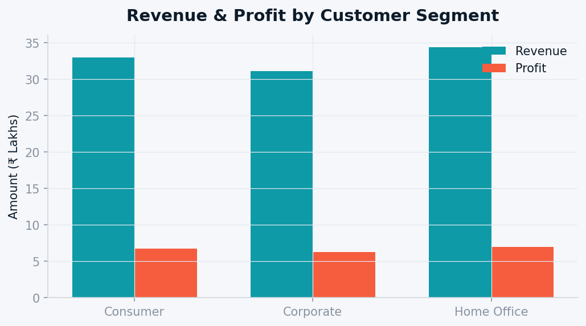
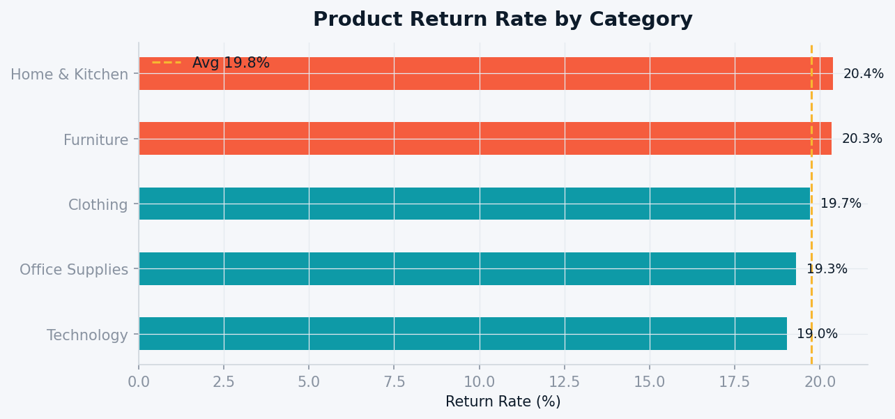

# 🛒 E-Commerce Sales & Customer Intelligence Analytics
### A Complete End-to-End Business Analytics Case Study


---

# 🏢 Company: NovaCart India Pvt. Ltd.

NovaCart India Pvt. Ltd. is a fictional e-commerce company serving both B2C and B2B customers across India through multiple product categories and regional markets.

This project simulates a **real-world business analytics engagement** — covering:

- Business problem framing
- Data generation & cleaning
- Exploratory Data Analysis (EDA)
- KPI reporting
- Customer intelligence
- Executive-level recommendations
- Business impact estimation

---

# 🎯 Business Problem

NovaCart experienced rapid order growth but declining profitability and rising return rates. Leadership wanted answers to critical business questions related to revenue leakage, discounting strategy, customer retention, and regional underperformance.

This analytics project was created to identify the root causes and provide actionable strategic recommendations.

---

# ❓ Key Business Questions Answered

- Which product categories generate the highest revenue and profit?
- At what discount threshold does profitability collapse?
- Which customer segments have the highest lifetime value?
- Which region is underperforming operationally?
- How do discounts influence return rates?
- Which seasonal periods drive the most revenue?
- How can NovaCart improve retention and profitability?

---

# 🧠 Skills Demonstrated

- Exploratory Data Analysis (EDA)
- Business KPI Analysis
- Customer Segmentation
- Revenue & Profitability Analysis
- Data Cleaning & Transformation
- Data Visualization
- Executive Reporting
- Strategic Business Recommendation Framing
- Dashboard Design
- Presentation Storytelling

---

# ⚙️ Tech Stack

| Tool | Purpose |
|------|---------|
| Python 3.11 | Core programming language |
| Pandas | Data cleaning & aggregation |
| NumPy | Numerical computations |
| Matplotlib | Data visualization |
| Seaborn | Statistical charts & heatmaps |
| Faker | Synthetic data generation |
| Jupyter Notebook | Interactive analysis |
| PptxGenJS | Executive presentation deck |

---

# 🔄 Analytics Workflow

```text
Synthetic Data Generation
        ↓
Data Cleaning & Transformation
        ↓
Exploratory Data Analysis (EDA)
        ↓
Business KPI Analysis
        ↓
Customer & Regional Insights
        ↓
Visualizations & Dashboards
        ↓
Executive Recommendations
```


## 📁 Project Structure

Ecommerce_Analytics_Project/
│
├── data/
│   ├── orders.csv
│   └── customers.csv
│
├── notebooks/
│   └── ecommerce_analytics.ipynb
│
├── visuals/
│   ├── 01_monthly_revenue_trend.png
│   ├── 02_revenue_by_category.png
│   ├── 03_profit_margin_by_category.png
│   ├── 04_regional_performance.png
│   ├── 05_customer_segment.png
│   ├── 06_discount_impact.png
│   ├── 07_return_rate_by_category.png
│   ├── 08_shipping_analysis.png
│   ├── 09_seasonal_heatmap.png
│   ├── 10_top_subcategories.png
│   ├── 11_state_bubble_chart.png
│   ├── 12_ltv_distribution.png
│   ├── 13_quarterly_trend.png
│   └── 14_kpi_dashboard.png
│
├── reports/
│   ├── kpi_summary.csv
│   ├── category_analysis.csv
│   └── regional_analysis.csv
│
├── presentation/
│   └── NovaCart_Analytics_Deck.pptx
│
├── scripts/
│   ├── generate_data.py
│   ├── run_analysis.py
│   └── build_notebook.py
│
├── README.md
└── requirements.txt

## 🧹 Data Preparation & Cleaning

The raw synthetic dataset was cleaned and transformed before analysis.

Data Cleaning Steps

Removed duplicate order records

Standardised date formats

Handled missing shipping values

Validated product category mappings

Corrected inconsistent regional labels

Created derived business metrics

## Feature Engineering

Additional analytical columns were created:

Profit Margin %

Customer Lifetime Value (LTV)

Return Flag

Order Quarter

Discount Bucket

Shipping Delay Category

## 📊 KPI Summary

| KPI                         | Value       |
| --------------------------- | ----------- |
| Total Revenue               | ₹98.5 Lakhs |
| Total Profit                | ₹20.0 Lakhs |
| Profit Margin               | 20.3%       |
| Avg Order Value             | ₹825        |
| Return Rate                 | 19.8% ⚠️    |
| Total Orders                | 11,940      |
| Generated Customers         | 1,500       |
| Active Purchasing Customers | ~1,200      |

## 📸 Executive Dashboard

The final KPI dashboard summarises revenue, profitability, customer trends, and operational performance.



## 📈 Monthly Revenue Trend

Seasonal analysis showed strong festive-quarter dependency with peak performance during Oct–Dec.



## 💰 Revenue by Category

Technology contributed the highest revenue share, while Clothing delivered significantly better profit margins.



## 📉 Discount vs Profitability Analysis

One of the most critical findings:
orders with discounts above 30% generated negative average profit margins.

This indicates that NovaCart was effectively subsidising customer purchases.



## 🌍 Regional Performance Analysis

The East region showed the weakest performance in both revenue contribution and profit margin.



## 👥 Customer Segment Analysis

Corporate customers generated significantly higher average lifetime value compared to consumer customers.



## 🔁 Return Rate Analysis

Higher discount ranges were strongly correlated with increased product return rates.



## 📌 Key Findings
1️⃣ Discount Crisis

Orders with 31–50% discounts generated negative profit margins.

Business Impact

NovaCart was losing money on heavily discounted transactions.

2️⃣ East Region Underperformance

The East region contributed less than 20% of total revenue and had the lowest regional profit margin.

Business Impact

Indicates operational inefficiencies and low market penetration.

3️⃣ Customer Retention Problem

Nearly 40% of customers were one-time buyers.

Business Impact

Improving retention by just 10% could generate ₹6–8L additional annual revenue.

4️⃣ Category Imbalance

Clothing products generated higher margins than Technology but received lower strategic focus.

Business Impact

Inventory and marketing allocation were misaligned with profitability.

5️⃣ Seasonal Revenue Dependency

Approximately 35% of annual revenue occurred during Oct–Dec festive months.

Business Impact

Revenue concentration increases business risk during non-festive periods.

6️⃣ Corporate Segment Opportunity

Corporate customers showed 40% higher lifetime value than standard consumers.

Business Impact

The B2B channel remains underdeveloped despite strong profitability potential.

## 🚀 Strategic Recommendations

| # | Recommendation                                         | Priority  | Estimated Impact          |
| - | ------------------------------------------------------ | --------- | ------------------------- |
| 1 | Cap discounts at 20% with CFO approval above threshold | 🔴 HIGH   | +₹15–20L profit           |
| 2 | Launch “NovaCart Plus” loyalty program                 | 🔴 HIGH   | +₹6–8L revenue            |
| 3 | Expand East region logistics & awareness campaigns     | 🟠 MEDIUM | +15% East revenue         |
| 4 | Develop dedicated B2B account management               | 🔴 HIGH   | +25–35% Corporate revenue |
| 5 | Increase Clothing category SKUs by 40%                 | 🟠 MEDIUM | Margin increase 20% → 24% |
| 6 | Improve product visuals to reduce returns              | 🟠 MEDIUM | Return rate 19.8% → 14%   |


## 📊 Reports Generated

The project exports multiple analytical reports:

| Report                  | Description                           |
| ----------------------- | ------------------------------------- |
| `kpi_summary.csv`       | Overall business KPI summary          |
| `category_analysis.csv` | Category-level profitability analysis |
| `regional_analysis.csv` | Region-wise revenue & margin analysis |


## 📽 Executive Presentation

A complete 14-slide executive PowerPoint deck was created for stakeholder presentation.

Includes:

KPI overview

Business problem analysis

Key visual insights

Profitability analysis

Customer intelligence

Strategic recommendations

ROI projections

## ⚙️ Installation & Setup

1️⃣ Clone the Repository
```bash
git clone https://github.com/your-username/Ecommerce_Analytics_Project.git

cd Ecommerce_Analytics_Project
```

2️⃣ Install Dependencies
```bash
pip install -r requirements.txt
```

3️⃣ Generate Synthetic Dataset
```bash
python scripts/generate_data.py
```

4️⃣ Run Full Analytics Pipeline
```bash
python scripts/run_analysis.py
```

5️⃣ Open Jupyter Notebook
```bash
jupyter notebook notebooks/ecommerce_analytics.ipynb
```


## 🔮 Future Improvements

 Customer churn prediction model

 RFM customer segmentation

 ARIMA / Prophet demand forecasting

 Interactive Plotly dashboard

 Streamlit deployment

 Recommendation engine

 A/B testing framework
 
 SQL warehouse integration

 Real-time KPI monitoring


